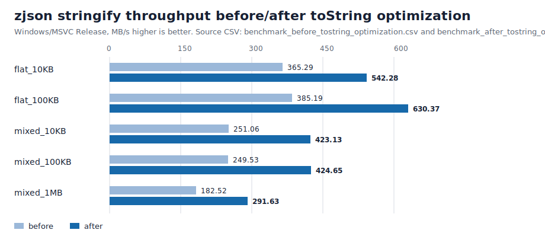

# ZJSON 性能测试报告：toString 序列化优化版

> 测试时间：2026-05-26  
> 环境：Windows，CMake `x64-release` preset，MSVC Release `/O2`，`bench_zjson`。  
> 对照库：zjson、nlohmann/json、RapidJSON、simdjson。  
> 本版重点：针对 `Json::toString()` 紧凑序列化路径做 profiling、优化与复测。

## 摘要

本轮优化前，`zjson` 的 parse/copy 已明显优于 nlohmann/json，但 stringify 是主要短板，尤其在 mixed 嵌套数据集上低于 nlohmann/json 和 RapidJSON。

本轮对 `toString()` 路径做了三类优化：

- 字符串转义从逐字节 `push_back` 改为连续块 `append`，普通 ASCII 字符串只做扫描和一次大块追加。
- 控制字符 `\u00xx` 转义改为固定十六进制表拼接，避免 `snprintf`。
- 数字整数 fast path 从 `snprintf("%lld")` 改为 C++17 `std::to_chars`。
- 紧凑序列化保留显式栈，但改为逗号感知输出，不再先写尾逗号再 `insert` / 删除。

最终结果：`zjson` stringify 在 5 个数据集上提升 **1.48x ~ 1.70x**。优化后，`zjson` 在本轮 stringify 测试中整体超过 nlohmann/json；在 `mixed_10KB` / `mixed_100KB` 上与 RapidJSON 接近或略高，在 `flat_100KB` 和 `mixed_1MB` 上仍落后 RapidJSON。

完整 CSV：

- 优化前：[`benchmark_before_tostring_optimization.csv`](benchmark_before_tostring_optimization.csv)
- 优化后：[`benchmark_after_tostring_optimization.csv`](benchmark_after_tostring_optimization.csv)

图表：



## Profiling 方法与结论

当前环境是 Windows/MSVC Release，未使用 Linux `perf` / callgrind 这类采样工具。本轮 profiling 采用 benchmark 内部隔离 microbench，直接测序列化热点函数的吞吐：

- `escape_clean`：无转义普通字符串，模拟常见 key/value。
- `escape_mixed`：包含引号、反斜杠和控制字符的字符串。
- `format_integer`：整数数字输出路径。
- `format_float`：浮点数字输出路径。

| Hotspot | Before MB/s | After MB/s | Speedup |
| --- | ---: | ---: | ---: |
| `escape_clean` | 1140.42 | 1421.13 | 1.25x |
| `escape_mixed` | 513.19 | 863.03 | 1.68x |
| `format_integer` | 244.91 | 447.04 | 1.83x |
| `format_float` | 281.86 | 288.24 | 1.02x |

结论：

- 字符串转义是可见热点，尤其是混合转义字符串；连续块 append 和固定表转义有效。
- mixed 数据集里整数很多，`to_chars` 替换整数 `snprintf` 收益明显。
- 浮点路径本来已使用 `to_chars` 优先，收益较小，符合预期。
- 原 compact serializer 的尾逗号修补逻辑会引入额外状态判断和字符串尾部修改；改成逗号感知输出后，mixed 嵌套场景收益最大。

## zjson Stringify Before / After

单位为 MB/s，数值越高越好。

| Dataset | Before | After | Speedup |
| --- | ---: | ---: | ---: |
| `flat_10KB` | 365.29 | 542.28 | 1.48x |
| `flat_100KB` | 385.19 | 630.37 | 1.64x |
| `mixed_10KB` | 251.06 | 423.13 | 1.69x |
| `mixed_100KB` | 249.53 | 424.65 | 1.70x |
| `mixed_1MB` | 182.52 | 291.63 | 1.60x |

## 优化后 Comparative Benchmark

说明：

- throughput 单位均为 MB/s。
- simdjson 当前在本 benchmark 中只统计 parse；它不是通用可变 DOM + copy/stringify 同口径实现，因此未参与 stringify/copy 对照。
- `flat_*` 偏宽对象，`mixed_*` 偏混合对象/数组嵌套。

### Parse Throughput

| Library | flat_10KB | flat_100KB | mixed_10KB | mixed_100KB | mixed_1MB |
| --- | ---: | ---: | ---: | ---: | ---: |
| zjson | 114.78 | 110.21 | 83.43 | 91.71 | 84.28 |
| nlohmann/json | 61.04 | 53.61 | 60.79 | 61.70 | 57.86 |
| RapidJSON | 621.32 | 638.09 | 489.75 | 383.92 | 503.06 |
| simdjson | 1152.50 | 1266.93 | 926.33 | 918.26 | 950.18 |

### Stringify Throughput

| Library | flat_10KB | flat_100KB | mixed_10KB | mixed_100KB | mixed_1MB |
| --- | ---: | ---: | ---: | ---: | ---: |
| zjson | 542.28 | 630.37 | 423.13 | 424.65 | 291.63 |
| nlohmann/json | 311.61 | 354.57 | 350.38 | 377.85 | 332.94 |
| RapidJSON | 754.84 | 1044.70 | 420.86 | 422.16 | 429.97 |

### Copy Throughput

| Library | flat_10KB | flat_100KB | mixed_10KB | mixed_100KB | mixed_1MB |
| --- | ---: | ---: | ---: | ---: | ---: |
| zjson | 515.41 | 626.72 | 368.14 | 368.08 | 186.31 |
| nlohmann/json | 224.25 | 257.50 | 151.47 | 156.71 | 99.75 |
| RapidJSON | 1133.22 | 1351.51 | 907.28 | 819.74 | 1001.68 |

## 正确性验证

本轮新增序列化回归测试：

- object 中空字符串 key 对应 object/array 子容器时，compact `toString()` 必须输出合法 key，而不能漏掉 `"":`。
- generic control bytes 需要输出为 `\u00xx`。

验证命令：

```bash
cmake --build out/build/x64-release
ctest --test-dir out/build/x64-release --output-on-failure
```

结果：

```text
100% tests passed, 0 tests failed out of 10
```

## 工程判断

本轮没有改变公开 API，也没有改变 `toString()` 的历史顶层字符串行为。compact 序列化仍使用显式栈，避免为性能把非递归路径退回调用栈。

保留 `estimateSerializedSize()` + `reserve()` 的策略。虽然它带来一次预遍历，但在当前数据集上，输出字符串分配和复制成本仍然值得提前控制；本轮更确定的瓶颈是转义、数字格式化和尾逗号修补逻辑。

## 结论

- `toString()` 路径已从明显短板提升为 zjson 的可展示优势之一：优化后 stringify 在多数数据集上超过 nlohmann/json。
- RapidJSON 在大宽对象和 1MB mixed 输出上仍更强，主要来自连续内存 DOM、专门 Writer 和更成熟的输出缓冲策略。
- 如果继续追求极限，下一步应评估“输出 writer / sink 接口”和“序列化 size cache 或 builder-time size accounting”，但这会触及更大的 API 与内部状态设计，不适合作为本轮局部优化继续硬拧。