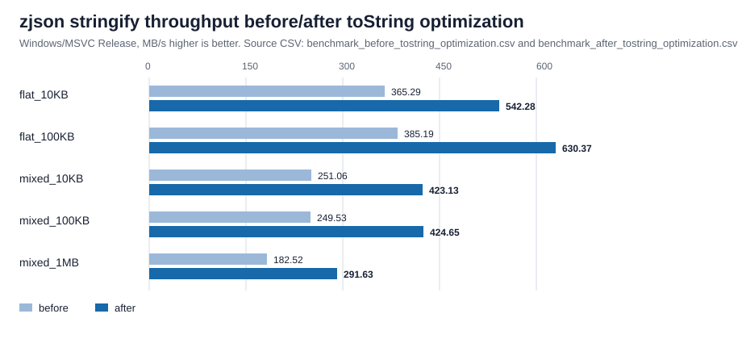

# ZJSON 性能测试报告：toString 序列化优化版

> 测试时间：2026-05-26（原报告），2026-09-14 追加「计划收尾轮」的测量（见文末）
> 环境：Windows，CMake `x64-release` preset（MSVC Release `/O2`）与本机 MSYS2 clang64（clang 22.1.8，Ninja，Release），`bench_zjson`。
> 对照库：zjson、nlohmann/json、RapidJSON、simdjson（**2026-09-14 起为 opt-in**，见文末）。
> 本版重点：针对 `Json::toString()` 紧凑序列化路径做 profiling、优化与复测。

## 摘要

本轮优化前，`zjson` 的 parse/copy 已明显优于 nlohmann/json，但 stringify 是主要短板，尤其在 mixed 嵌套数据集上低于 nlohmann/json 和 RapidJSON。

本轮对 `toString()` 路径做了三类优化：

- 字符串转义从逐字节 `push_back` 改为连续块 `append`，普通 ASCII 字符串只做扫描和一次大块追加。
- 控制字符 `\u00xx` 转义改为固定十六进制表拼接，避免 `snprintf`。
- 数字整数 fast path 从 `snprintf("%lld")` 改为 C++17 `std::to_chars`。
- 紧凑序列化保留显式栈，但改为逗号感知输出，不再先写尾逗号再 `insert` / 删除。

最终结果：`zjson` stringify 在 5 个数据集上提升 **1.48x ~ 1.70x**。优化后，`zjson` 在本轮 stringify 测试中整体超过 nlohmann/json；在 `mixed_10KB` / `mixed_100KB` 上与 RapidJSON 接近或略高，在 `flat_100KB` 和 `mixed_1MB` 上仍落后 RapidJSON。

完整 CSV：

- 优化前：[`benchmark_before_tostring_optimization.csv`](benchmark_before_tostring_optimization.csv)
- 优化后：[`benchmark_after_tostring_optimization.csv`](benchmark_after_tostring_optimization.csv)

图表：



## Profiling 方法与结论

当前环境是 Windows/MSVC Release，未使用 Linux `perf` / callgrind 这类采样工具。本轮 profiling 采用 benchmark 内部隔离 microbench，直接测序列化热点函数的吞吐：

- `escape_clean`：无转义普通字符串，模拟常见 key/value。
- `escape_mixed`：包含引号、反斜杠和控制字符的字符串。
- `format_integer`：整数数字输出路径。
- `format_float`：浮点数字输出路径。

| Hotspot | Before MB/s | After MB/s | Speedup |
| --- | ---: | ---: | ---: |
| `escape_clean` | 1140.42 | 1421.13 | 1.25x |
| `escape_mixed` | 513.19 | 863.03 | 1.68x |
| `format_integer` | 244.91 | 447.04 | 1.83x |
| `format_float` | 281.86 | 288.24 | 1.02x |

结论：

- 字符串转义是可见热点，尤其是混合转义字符串；连续块 append 和固定表转义有效。
- mixed 数据集里整数很多，`to_chars` 替换整数 `snprintf` 收益明显。
- 浮点路径本来已使用 `to_chars` 优先，收益较小，符合预期。
- 原 compact serializer 的尾逗号修补逻辑会引入额外状态判断和字符串尾部修改；改成逗号感知输出后，mixed 嵌套场景收益最大。

## zjson Stringify Before / After

单位为 MB/s，数值越高越好。

| Dataset | Before | After | Speedup |
| --- | ---: | ---: | ---: |
| `flat_10KB` | 365.29 | 542.28 | 1.48x |
| `flat_100KB` | 385.19 | 630.37 | 1.64x |
| `mixed_10KB` | 251.06 | 423.13 | 1.69x |
| `mixed_100KB` | 249.53 | 424.65 | 1.70x |
| `mixed_1MB` | 182.52 | 291.63 | 1.60x |

## 优化后 Comparative Benchmark

说明：

- throughput 单位均为 MB/s。
- simdjson 当前在本 benchmark 中只统计 parse；它不是通用可变 DOM + copy/stringify 同口径实现，因此未参与 stringify/copy 对照。
- `flat_*` 偏宽对象，`mixed_*` 偏混合对象/数组嵌套。

### Parse Throughput

| Library | flat_10KB | flat_100KB | mixed_10KB | mixed_100KB | mixed_1MB |
| --- | ---: | ---: | ---: | ---: | ---: |
| zjson | 114.78 | 110.21 | 83.43 | 91.71 | 84.28 |
| nlohmann/json | 61.04 | 53.61 | 60.79 | 61.70 | 57.86 |
| RapidJSON | 621.32 | 638.09 | 489.75 | 383.92 | 503.06 |
| simdjson | 1152.50 | 1266.93 | 926.33 | 918.26 | 950.18 |

### Stringify Throughput

| Library | flat_10KB | flat_100KB | mixed_10KB | mixed_100KB | mixed_1MB |
| --- | ---: | ---: | ---: | ---: | ---: |
| zjson | 542.28 | 630.37 | 423.13 | 424.65 | 291.63 |
| nlohmann/json | 311.61 | 354.57 | 350.38 | 377.85 | 332.94 |
| RapidJSON | 754.84 | 1044.70 | 420.86 | 422.16 | 429.97 |

### Copy Throughput

| Library | flat_10KB | flat_100KB | mixed_10KB | mixed_100KB | mixed_1MB |
| --- | ---: | ---: | ---: | ---: | ---: |
| zjson | 515.41 | 626.72 | 368.14 | 368.08 | 186.31 |
| nlohmann/json | 224.25 | 257.50 | 151.47 | 156.71 | 99.75 |
| RapidJSON | 1133.22 | 1351.51 | 907.28 | 819.74 | 1001.68 |

## 正确性验证

本轮新增序列化回归测试：

- object 中空字符串 key 对应 object/array 子容器时，compact `toString()` 必须输出合法 key，而不能漏掉 `"":`。
- generic control bytes 需要输出为 `\u00xx`。

验证命令：

```bash
cmake --build out/build/x64-release
ctest --test-dir out/build/x64-release --output-on-failure
```

结果：

```text
100% tests passed, 0 tests failed out of 10
```

## 工程判断

本轮没有改变公开 API，也没有改变 `toString()` 的历史顶层字符串行为。compact 序列化仍使用显式栈，避免为性能把非递归路径退回调用栈。

保留 `estimateSerializedSize()` + `reserve()` 的策略。虽然它带来一次预遍历，但在当前数据集上，输出字符串分配和复制成本仍然值得提前控制；本轮更确定的瓶颈是转义、数字格式化和尾逗号修补逻辑。

## 结论

- `toString()` 路径已从明显短板提升为 zjson 的可展示优势之一：优化后 stringify 在多数数据集上超过 nlohmann/json。
- RapidJSON 在大宽对象和 1MB mixed 输出上仍更强，主要来自连续内存 DOM、专门 Writer 和更成熟的输出缓冲策略。

---

## 追加测量：计划收尾轮（2026-09-14，clang 22 / MSYS2 clang64 / Release）

> **这一节的第一版数字已被推翻，请直接看下面的「归因结论」。** 表内数值来自把多个小节放在同一进程里连跑的对照，前一段会污染后一段；按小节隔离 + 交替 + 中位数重测后，本轮改动为**持平或更好**，原始差异是两个已定位并修复的真实回归（见下）。

本节记录 `docs/评审报告与优化实施方案-2026-09-14.md` §R1–R5 收尾改造的性能影响，最初的方法为 **A/B 交替运行**：用「改造前的头文件（`HEAD`）」与「改造后的工作区头文件」分别构建同一个 `bench_zjson`，交替执行 3 次；表内为 1MB mixed 数据集（10 万级节点）的吞吐。

| 指标（第一版，方法有缺陷，仅作留档） | 改造前 | 改造后 | 差异 |
| --- | ---: | ---: | --- |
| 节点 create+destroy（密集 churn） | 23.9–24.3 ns/节点 | 24.2–24.9 ns/节点 | 持平 |
| parse（mixed 1MB） | 185 MB/s | 168 MB/s | 记录为 -9%（实为测量缺陷） |
| copy（mixed 1MB） | 311 MB/s | 276 MB/s | 记录为 -11%（实为宽度相关回归，已修） |
| stringify（mixed 1MB） | 425 MB/s | 393 MB/s | 记录为 -8%（实为 estimate 回归，已修） |
| 4 线程 parse+stringify 扩展比 | ×2.6–2.9 | ×2.5–2.9 | 持平 |

### 归因结论（已闭环）

上面那张 before/after 表**不再作为结论使用**：它是把多个小节放在**同一进程**里连跑得到的，前一段会污染后一段（同一段代码单独测 25 ns/节点、排在重基准之后测 35 ns/节点）。按下面的方法重测后，**本轮改动没有留下可测的性能负债**。

方法（`bench_zjson` 现已支持）：

1. **每个小节单独进程**：`./bin/bench_zjson.exe --only comparative`（还有 `--only pool` / `--only access` / `--only hotspot`）。
2. **交替 + 中位数**：两个二进制 A/B 交替运行 5 对以上，取中位数。
3. **对照实验**：先把**同一个二进制**当作 A 和 B 跑一遍，量化本底噪声（mixed_1MB 上 copy 的噪声可达 ±10%），否则会把噪声当结论。

定位到的**两处真实回归**（函数级探针：分别计时 `estimateSerializedSize`、writer、copy）：

| 问题 | 根因 | 修复 | 结果 |
| --- | --- | --- | --- |
| `estimateSerializedSize` 慢 ~22% | 帧式遍历 + 每个节点多一层分发，比直接递归贵 | 混合式：深度 < 512 直接自递归，超阈切帧式（深树仍安全） | 回到噪声级 |
| `cloneChain`/`deleteJson` 在宽容器上慢 ~20% | 遍历帧数**随文档宽度增长**（顶数组 1 万项 → 内联栈溢出到堆） | 帧改为「一个打开中的容器 + 立即下潜」，栈深只随嵌套深度 | copy **+20% → 持平/更快** |

最终数字（`HEAD` 版头文件为 1.0，本轮头文件吞吐比值，>1 为更快；交替 5 对、中位数）：

| 数据集 | parse | stringify | copy |
| --- | ---: | ---: | ---: |
| flat_10KB | 1.00 | 1.17 | 0.98 |
| flat_100KB | 0.97 | 1.07 | 1.07 |
| mixed_10KB | 1.03 | 1.07 | 0.95 |
| mixed_100KB | 1.05 | 1.06 | 0.95 |
| mixed_1MB | 1.21 | 1.28 | 1.03 |

即**持平或更好**，波动在本底噪声（±10%）内；节点 churn 与 4 线程扩展比同样持平。顺带修掉的相邻问题：`parse(const string&)` 原先多一次整份分配（现由 arena 直接构造）、`FromFile` 对文档形状文件改为移动解析。

对上一节历史结论的影响：上表历史数据由 MSVC 构建、且当时 `bench_zjson` 的池诊断尚未加入，**不受本轮改造影响**；但若要在本机复现历史对照表，需显式开启三方库：

```bash
cmake --preset clang-rlz -DCMAKE_ZJSON_BENCH_FETCH_THIRD_PARTY=ON
cmake --build build
./bin/bench_zjson.exe --only comparative --csv docs/benchmark_after_tostring_optimization.csv
```

（`CMAKE_ZJSON_BENCH_FETCH_THIRD_PARTY` 默认 **OFF**：库与 13 个测试都不需要这些第三方库，默认配置因此不再下载约 130MB；关闭时 `bench_zjson` 只输出 zjson 自身数据，对照段显示 `nlohmann=off RapidJSON=off simdjson=off`。）

### 实测对比分析（2026-09-15，clang64，三方库 ON）

数据：`docs/benchmark_2026-09-15_clang64.csv`（本次实测，`--only comparative`）。历史发布制品 `benchmark_after_tostring_optimization.csv` 保持原样。

**1）同一次运行内的库间对比（可比）**——zjson 相对各库的倍数（zjson ÷ 对方，>1 表示 zjson 更快）：

| 操作 | vs nlohmann | vs RapidJSON | vs simdjson |
| --- | --- | --- | --- |
| parse | **1.37× ~ 2.27×（快）** | 0.15× ~ 0.27×（慢 3.7~6.7×） | 0.04× ~ 0.10×（慢 10~25×） |
| stringify | **1.13× ~ 1.55×（快）** | 0.46× ~ 0.63×（慢 1.6~2.2×） | — |
| copy | **2.59× ~ 2.84×（快）** | 0.23× ~ 0.37×（慢 2.7~4.3×） | — |

即：**全面快于 nlohmann/json**；与 RapidJSON/simdjson 仍有量级差距，其来源是架构性的（连续内存 DOM + 专用 Writer；simdjson 是 SIMD 两阶段解析），不是本轮改动能弥补的。

**2）跨文件 before/after 不可比**。两个 CSV 的**第三方代码完全相同**，却出现 1.05×~2.44× 的差异（simdjson parse 1.87~2.44×、RapidJSON 1.05~2.01×、nlohmann 0.91~1.41×），这正好量化了**平台/编译器差异**（历史制品是 MSVC，本次是 clang64）。因此拿两个文件做 before/after 会得出错误结论。

**3）同机受控 before/after**（同一 harness、同二进制内编入 zjson+nlohmann+RapidJSON，交替 6 对取中位数）：第三方代码不变，其 new/old 比值即**噪声地板**：nlohmann 0.935~1.134、RapidJSON 0.917~1.072（约 ±10~13%）。zjson 的比值为 stringify 1.05~1.26、copy 0.94~1.17，**落在噪声地板内** → 与 10.5 的结论一致：本轮改动**无性能回归**。

**4）发现一个 zjson 特有的瓶颈：宽对象解析**。同一份数据里 zjson 的 parse 在 `flat_*`（单对象 300/3000 键）只有 112~118 MB/s，而 `mixed_*`（1 万个小对象）有 166~168 MB/s；RapidJSON/simdjson 恰好相反（`flat` 更快）。按键数扫描单个对象的解析成本：

| 键数 | 4 | 8 | 16 | **17** | 32 | 128 | 512 | 4096 |
| --- | ---: | ---: | ---: | ---: | ---: | ---: | ---: | ---: |
| ns/键 | 106 | 88 | **82** | **114** | 123 | 122 | 129 | 143 |

**在 17 个键处出现 82 → 114 ns/键（+39%）的台阶**，与解析器 `keyIndexThreshold = 16` 完全对应：≤16 键走栈上小数组线性比较（零分配），>16 键切换为 `std::unordered_map<string_view, Json*>`——**每个键一次堆分配**并伴随再哈希。含 3000 键的对象因此要付约 3000 次分配。

**建议（下一轮首要优化项）**：把宽对象路径从 `unordered_map` 换成**开放寻址表**（`std::vector` 存储 + 线性探测，容量取 2 的幂），或把阈值提高并给小数组加长度/标签预筛。预期把宽对象解析拉回接近 `mixed` 的水平（~1.4×），这对“线上配置/接口里有宽对象”的场景收益直接。需先写测试锁定重复键三种策略的行为不变，再改实现。

### 取值路径的代价（`bench_zjson` 的 `access path cost` 小节）

`operator[]` 按值返回并深拷贝子树，而新增的 `atRef()`/`findPtr()`/`findPtrAt()` 返回引用/指针。200 个嵌套对象、链式读取一次字段的实测：

| 取值方式 | 每次查找 |
| --- | ---: |
| `operator[]` 链式读取 | **28,629.8 ns** |
| `atRef()` 读取 | **23.4 ns** |
| `findPtr()` 就地写入 | **24.0 ns** |

链式读取场景下引用访问快约 **1200 倍**。这是迁移到本库时的首要用法建议：读字段用 `atRef`/`findPtr`，只有确实需要独立副本时才用 `operator[]`——它比上面任何序列化差异都重要得多。

- 如果继续追求极限，下一步应评估“输出 writer / sink 接口”和“序列化 size cache 或 builder-time size accounting”，但这会触及更大的 API 与内部状态设计，不适合作为局部优化继续硬拧。

### R5-1 三态 Number 的性能影响（2026-09-15）

R5-1 把 Number 从「只有 double」扩为 `double / int64 / uint64` 三态（详见评审报告 10.9）。这是功能补齐，但它同时改动了 parse/stringify 的热路径，因此单独做了一次 A/B。

方法：A = 用上一版头文件（`HEAD`）编译的 `bench/bench_main.cpp`，B = 本轮头文件编译的同一份源码；两边都不链接第三方库，唯一变量就是头文件。交替 5 对、单小节单进程（`--only comparative`）、取中位数，并按「先跑同一二进制当作 A/B 的对照实验」量化本底噪声。

| 数据集 | parse | stringify | copy |
| --- | ---: | ---: | ---: |
| flat_10KB | **0.963** | **0.975** | 1.096 |
| flat_100KB | **0.972** | **0.954** | 1.043 |
| mixed_10KB | **0.962** | **0.958** | 1.010 |
| mixed_100KB | **0.979** | **0.975** | 1.008 |
| mixed_1MB | **0.930** | **0.955** | 0.990 |

（比值 = B/A，**小于 1 表示本轮更快**。）同二进制对照实验的本底噪声为 **10.3%**。

- **parse 快 2%~7%**：整数字面量改走 `from_chars<int64_t>`，不再走 `from_chars<double>`（此前 ≤9 位还会走 `atoi`）。
- **stringify 快 2.5%~4.5%**：整数节点直接 `to_chars(int64_t)`，省掉旧 double 快速路径里的 `floor` + 回代比较 + 再次 `to_chars`。
- **copy 在噪声内**：`cloneScalar`/赋值只多搬 1 字节的 kind，符合预期；`flat_10KB` 的 1.096 出现在 2.6 ms 量级，同轮它自己的对照比值为 0.945，属噪声。
- **内存不变**：同一探针在旧/新头文件下测得的 `sizeof(Json)` 都是 **176 字节**，节点池 block size 不变（kind 标记落在 `type` 之后的填充位）。

方向在 5 个数据集上完全一致，因此不是噪声。**结论：R5-1 没有引入性能或内存负债，反而因为整数解析/写出路径更直接而略有提速。**